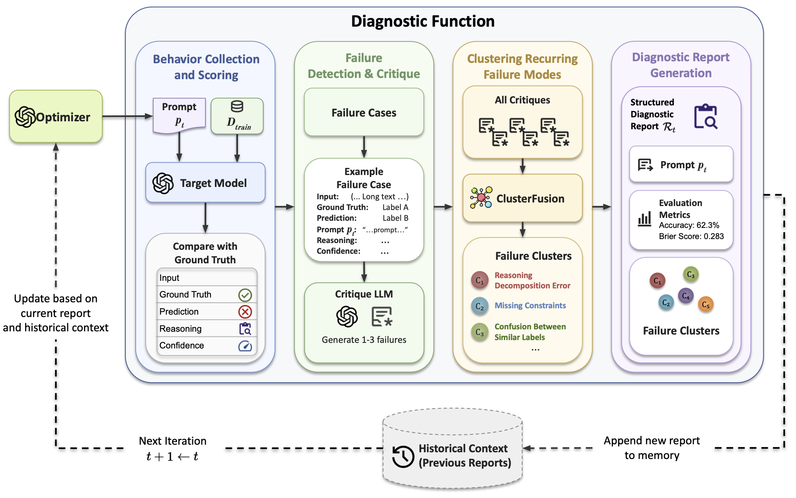

# Reflective Prompt Tuning: Function-Calling Prompt Optimization

This repository contains the cleaned implementation for the paper
[Reflective Prompt Tuning through Language Model Function-Calling](https://arxiv.org/abs/2605.21781).

RPT automates prompt improvement by using an optimizer LLM with function-calling abilities to invoke diagnostic tools, analyze the target model’s failures, and produce structured evaluation reports. Each report, together with the history of earlier reports, is fed back to the optimizer, which iteratively refines the target prompt.



---

## Reflective Prompt Tuning

RPT is a function-calling workflow for iterative prompt optimization. Given a task, a target model, and an initial prompt program, the system repeatedly:

1. evaluates the current prompt on an optimization split,
2. diagnoses recurring failure modes,
3. summarizes calibration and task metrics,
4. asks an optimizer model to propose a prompt patch or stop,
5. selects the final prompt using held-out validation performance.

The cleaned repository supports three tasks:

- `hotpotqa`
- `livebench_math`
- `xbrl_formula`

---

## Repository Structure

```text
RPT/
├── .gitignore
├── LICENSE
├── README.md
├── data/
│   ├── hotpotqa/
│   │   └── .gitkeep
│   ├── livebench_math/
│   │   └── .gitkeep
│   └── xbrl_formula/
│       └── .gitkeep
├── figs/
│   └── RPT_overview.png
├── requirements.txt
├── rpt/
│   ├── __init__.py
│   ├── analysis/
│   │   ├── __init__.py
│   │   ├── cluster_failures_and_patches.py
│   │   ├── cluster_fusion.py
│   │   ├── interpret_data_using_heatmaps.py
│   │   ├── paths.py
│   │   └── performance_summarization_and_analysis.py
│   ├── common.py
│   ├── data/
│   │   ├── __init__.py
│   │   └── prepare.py
│   ├── gemini_utils.py
│   ├── paths.py
│   └── tasks/
│       ├── __init__.py
│       ├── hotpotqa.py
│       ├── hotpotqa_gemini.py
│       ├── livebench_math.py
│       ├── livebench_math_gemini.py
│       ├── xbrl_formula.py
│       └── xbrl_formula_gemini.py
└── run_analysis_pipeline.sh
```

Generated artifacts are ignored by git: `logs/`, `clustering_results/`, `vis_results/`, `results/`, `analysis_reports/`, and generated `data/**/*.jsonl` files.

---

## Requirements

Use Python `>= 3.10`.

Install dependencies:

```bash
pip install -r requirements.txt
```

For editable local development, optionally create a virtual environment first:

```bash
python -m venv .venv
source .venv/bin/activate
pip install -r requirements.txt
```

---

## API Keys

Set only the credentials for the backend you plan to use.

For OpenAI target or optimizer runs:

```bash
export OPENAI_API_KEY="..."
```

For Gemini optimizer runs through Vertex AI:

```bash
export GOOGLE_CLOUD_PROJECT="..."
export GOOGLE_CLOUD_LOCATION="global"
```

---

## Datasets

The repository does not redistribute dataset JSONL files. It keeps the expected data directories in place and provides a preparation command that downloads or regenerates the same local split paths.

| Dataset | Local path | Split files | Upstream reference |
| --- | --- | --- | --- |
| HotpotQA | `data/hotpotqa/` | `train.jsonl`, `dev.jsonl`, `test.jsonl` | [HotpotQA](https://hotpotqa.github.io/) / [Hugging Face](https://huggingface.co/datasets/hotpotqa/hotpot_qa) |
| LiveBench Math | `data/livebench_math/` | `train.jsonl`, `val.jsonl`, `test.jsonl` | [LiveBench](https://livebench.ai/) / [Hugging Face](https://huggingface.co/datasets/livebench/math) |
| XBRL Formula | `data/xbrl_formula/` | `train.jsonl`, `val.jsonl`, `test.jsonl` | [ACE finance data](https://github.com/ace-agent/ace/tree/main/eval/finance/data) |

Prepare all datasets:

```bash
python -m rpt.data.prepare
```

The first run requires network access to Hugging Face and GitHub.

This writes:

- `data/hotpotqa/train.jsonl`, `data/hotpotqa/dev.jsonl`, and `data/hotpotqa/test.jsonl`
- `data/livebench_math/train.jsonl`, `data/livebench_math/val.jsonl`, and `data/livebench_math/test.jsonl`
- `data/xbrl_formula/train.jsonl`, `data/xbrl_formula/val.jsonl`, and `data/xbrl_formula/test.jsonl`

Prepare one dataset or overwrite existing files:

```bash
python -m rpt.data.prepare --dataset xbrl_formula
python -m rpt.data.prepare --force
```

Dataset paths can be overridden with environment variables:

```bash
export RPT_DATA_ROOT="/path/to/data"
export RPT_HOTPOTQA_DATA_DIR="/path/to/hotpotqa"
export RPT_LIVEBENCH_MATH_DATA_DIR="/path/to/livebench_math"
export RPT_XBRL_FORMULA_DATA_DIR="/path/to/xbrl_formula"
```

---

## Data Source Attribution

The generated local splits build on the following data sources:

1. HotpotQA
   * Source: [HotpotQA](https://hotpotqa.github.io/) and the [hotpotqa/hotpot_qa](https://huggingface.co/datasets/hotpotqa/hotpot_qa) Hugging Face mirror.
   * License: [CC BY-SA 4.0](https://creativecommons.org/licenses/by-sa/4.0/).

2. LiveBench Math
   * Source: [LiveBench](https://livebench.ai/) and the [livebench/math](https://huggingface.co/datasets/livebench/math) Hugging Face dataset.
   * License: [Apache License, Version 2.0](https://www.apache.org/licenses/LICENSE-2.0).

3. XBRL Formula
   * Source: [ACE finance data](https://github.com/ace-agent/ace/tree/main/eval/finance/data).
   * License: [Apache License, Version 2.0](https://www.apache.org/licenses/LICENSE-2.0).

Please refer to the respective upstream sources for complete licensing terms and attribution requirements.

---

## Quick Start

Prepare the local JSONL splits first:

```bash
python -m rpt.data.prepare
```

Run an OpenAI optimizer:

```bash
python -m rpt.tasks.hotpotqa --iters 40
python -m rpt.tasks.xbrl_formula --iters 40
python -m rpt.tasks.livebench_math --iters 40
```

Run a Gemini optimizer:

```bash
python -m rpt.tasks.hotpotqa_gemini --iters 40 --optimizer_name gemini-3.1-pro
python -m rpt.tasks.livebench_math_gemini --iters 40 --optimizer_name gemini-3.1-pro
python -m rpt.tasks.xbrl_formula_gemini --iters 40 --optimizer_name gemini-3.1-pro
```

Prepare or inspect cached LiveBench Math splits without running optimization:

```bash
python -m rpt.tasks.livebench_math --prepare_only
```

Evaluate the seed prompt only:

```bash
python -m rpt.tasks.hotpotqa --evaluate_only
python -m rpt.tasks.livebench_math --evaluate_only
```

---

## Analysis Pipeline

Run the analysis pipeline for an existing log:

```bash
./run_analysis_pipeline.sh \
  --log_path logs/xbrl_formula/gpt-5/example.jsonl \
  --task_name xbrl_formula \
  --model_name gpt-5
```

The pipeline can generate:

- failure and patch corpora,
- ClusterFusion topics,
- human-readable topic labels,
- transition and persistence summaries,
- heatmaps and prompt-length plots.

---

## Outputs

RPT runs write JSONL logs containing prompt programs, train/dev/test metrics, diagnostic reports, decisions, and final evaluations. Analysis scripts write derived artifacts into task/model/log-specific subdirectories.

Common output locations:

- `logs/`
- `clustering_results/`
- `vis_results/`
- `analysis_reports/`
- `results/`

---

## Citation

If you use this repository, please cite our work:

```bibtex
@article{bayat2026reflectiveprompttuning,
  title = {Reflective Prompt Tuning through Language Model Function-Calling},
  author = {Fatahi Bayat, Farima and Aminnaseri, Moin and Pezeshkpour, Pouya and Hruschka, Estevam},
  year = {2026},
  url = {https://arxiv.org/abs/2605.21781}
}
```

---

## Disclosure

Embedded in, or bundled with, this product are open source software (OSS) components, datasets and other third party components identified below. The license terms respectively governing the datasets and third-party components continue to govern those portions, and you agree to those license terms, which, when applicable, specifically limit any distribution. You may receive a copy of, distribute and/or modify any open source code for the OSS component under the terms of their respective licenses, which may be CC license and Apache 2.0 license. In the event of conflicts between Megagon Labs, Inc., license conditions and the Open Source Software license conditions, the Open Source Software conditions shall prevail with respect to the Open Source Software portions of the software. You agree not to, and are not permitted to, distribute actual datasets used with the OSS components listed below. You agree and are limited to distribute only links to datasets from known sources by listing them in the datasets overview table below. You are permitted to distribute derived datasets of data sets from known sources by including links to original dataset source in the datasets overview table below. You agree that any right to modify datasets originating from parties other than Megagon Labs, Inc. are governed by the respective third party's license conditions. All OSS components and datasets are distributed WITHOUT ANY WARRANTY, without even implied warranty such as for MERCHANTABILITY or FITNESS FOR A PARTICULAR PURPOSE, and without any liability to or claim against any Megagon Labs, Inc. entity other than as explicitly documented in this README document. You agree to cease using any part of the provided materials if you do not agree with the terms or the lack of any warranty herein. While Megagon Labs, Inc., makes commercially reasonable efforts to ensure that citations in this document are complete and accurate, errors may occur. If you see any error or omission, please help us improve this document by sending information to contact_oss@megagon.ai.
